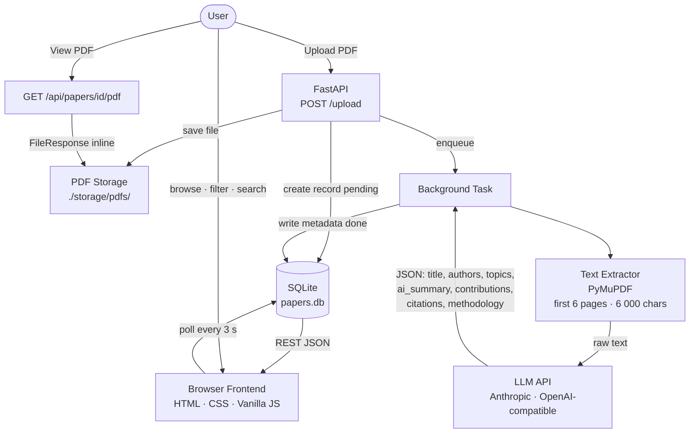

# paperlibrary

An intelligent agent that turns a folder of PDFs into a structured, searchable academic library.

Upload a paper → the agent reads it, reasons about its content, and extracts structured knowledge (title, authors, topics, AI-generated summary, key contributions, citations) → browse and filter everything in your browser.

No chat interface. No cloud storage. Just upload and explore.

---

## 🎬 Demo

> **[TODO: Add 2-minute demo video link here]**  
> Record a screen capture showing: upload → analysis → card/table view → detail modal → View PDF. Upload to YouTube or Bilibili and paste the link.

---

## Agent Design

paperlibrary is a **reactive intelligent agent** built around a perception → decision → action loop:

| Stage | What happens |
|---|---|
| **Perceive** | User uploads a PDF. PyMuPDF extracts up to 6 pages of text (abstract-first ordering) and truncates to 6 000 characters. |
| **Decide** | The LLM receives the extracted text and decides: what is the exact title? who are the authors? what methodology does it use? what are the key contributions and limitations? It outputs structured JSON. |
| **Act** | The agent writes the structured metadata to SQLite, marks the paper `done`, and the frontend reflects the update automatically (3-second polling). |

**Memory:** SQLite serves as the agent's persistent knowledge base — every analysed paper is retained and queryable across sessions.

**Safety:** Scanned PDFs (no extractable text), malformed LLM output (invalid JSON, markdown fences, `<think>` reasoning blocks), and network errors are all caught and surfaced as a `failed` status with a human-readable error message. Failed papers can be retried with one click.

**Tool use:** The agent uses two tools — a PDF text extractor (PyMuPDF) and an LLM API (Anthropic or any OpenAI-compatible endpoint). The LLM call is the only non-deterministic step; everything else is deterministic.

---

## System Architecture



**Key design decisions:**

- **No framework on the frontend** — plain HTML/CSS/JS keeps the install path trivial (no Node.js, no build step).
- **SQLite over Postgres** — the target is a single-user local tool; SQLite requires zero setup.
- **Abstract-first page ordering** — PyMuPDF re-orders pages so the abstract page is always near the top of the extracted text, improving LLM accuracy on long papers.
- **Provider-agnostic LLM layer** — a single `Analyzer` class dispatches to either the Anthropic SDK or a generic OpenAI-compatible HTTP call, selected by one env variable.

---

## Quick Start

### Requirements

- Python 3.11+
- An API key for Anthropic or any OpenAI-compatible provider (OpenAI, DeepSeek, MiniMax, etc.)

### Install

```bash
git clone https://github.com/miles031104/paperlibrary
cd paperlibrary
```

### Run (one click)

**Windows** — double-click `start.bat`

**Mac / Linux:**
```bash
bash start.sh
```

The script installs dependencies automatically on first run.  
The app then opens **http://localhost:8000** in your browser automatically.

### First-time setup wizard

If no API key is configured, a guided wizard runs in the terminal:

```
========================================================
  Welcome to paperlibrary — first-time setup
========================================================

Step 1/3  Choose your LLM provider

  1. Anthropic (Claude)
  2. OpenAI
  3. DeepSeek
  4. MiniMax
  5. Other (OpenAI-compatible)

  Enter number [1]:
```

Enter your provider, API key, and model — the wizard saves everything to `.env` and starts the app. Subsequent runs skip the wizard entirely.

### Manual configuration (alternative)

If you prefer to configure without the wizard, copy `.env.example` to `.env` and edit it:

```ini
PAPERLIBRARY_LLM_PROVIDER=anthropic
PAPERLIBRARY_LLM_API_KEY=sk-ant-...
PAPERLIBRARY_LLM_MODEL=claude-haiku-4-5
```

Then start with:
```bash
python -m paperlibrary
```

---

## Usage

### Upload a paper

Click **Upload PDF** in the top bar and select a `.pdf` file. A card appears immediately with a *Pending* badge. The agent analyses the paper in the background (typically 5–30 seconds depending on the model).

### Browse and switch views

Use the **⊞ / ☰** toggle (top-right of the filter bar) to switch between:

- **Card view** — visual grid with title, authors, topics, and one-line summary
- **Table view** — compact rows with Status · Title · Authors · Year · Venue · Method · Topics · Actions

### Filter and search

- **Filter dropdowns** — narrow by topic, year, methodology, or status
- **Search box** — full-text search across titles and summaries
- Clicking a topic chip in any view filters by that topic

### Detail modal

Click **Details** on any analysed paper to see:

- **AI Summary** — ~150-word structured synthesis: core problem, method, key findings (with numbers), limitations
- **Key Contributions** — bulleted list extracted by the LLM
- **View PDF ↗** — opens the original PDF in a new browser tab
- **Original Abstract** — collapsible; the author-written abstract for reference
- **References** — collapsible citation list

### Retry and delete

Failed papers show an error message. Click **Retry** to re-trigger analysis, or **Delete** to remove the record and file.

---

## Configuration

| Variable | Default | Description |
|---|---|---|
| `PAPERLIBRARY_LLM_PROVIDER` | `anthropic` | `anthropic` or `openai-compatible` |
| `PAPERLIBRARY_LLM_API_KEY` | — | Your API key |
| `PAPERLIBRARY_LLM_MODEL` | `claude-haiku-4-5` | Model name |
| `PAPERLIBRARY_LLM_BASE_URL` | — | Base URL (openai-compatible only) |
| `PAPERLIBRARY_STORAGE_PATH` | `./storage` | Where to store DB and uploaded PDFs |
| `PAPERLIBRARY_PORT` | `8000` | Server port |
| `PAPERLIBRARY_EXTRACT_PAGES` | `6` | Pages read per PDF |
| `PAPERLIBRARY_MAX_TEXT_CHARS` | `6000` | Max characters sent to LLM |

---

## REST API

The browser UI is built on a REST API you can also call directly:

| Method | Path | Description |
|---|---|---|
| `POST` | `/api/papers/upload` | Upload a PDF; triggers background analysis |
| `GET` | `/api/papers` | List papers — supports `?topic=`, `?year=`, `?methodology=`, `?status=`, `?q=` |
| `GET` | `/api/papers/{id}` | Full paper detail (all metadata fields) |
| `GET` | `/api/papers/{id}/pdf` | Serve the original PDF inline (browser-renderable) |
| `DELETE` | `/api/papers/{id}` | Delete paper record and file |
| `POST` | `/api/papers/{id}/analyze` | Re-trigger analysis |
| `GET` | `/api/health` | Health check — reports DB and LLM configuration status |

---

## Tests

```bash
pip install -r requirements-dev.txt
pytest tests/ -v
```

16 tests covering the PDF extractor, LLM analyser (mocked), and all API endpoints.

---

## Design Evolution

The project was built incrementally with one commit per concern. Key checkpoints:

| Commit | Design decision |
|---|---|
| `chore: project scaffold` | Established `pyproject.toml`-based layout with `pydantic-settings` config from the start — makes env-driven config trivial and testable. |
| `feat(db): SQLite init, Paper ORM model` | Chose SQLite + SQLAlchemy over a flat JSON store: gives queryable filters and a migration path without requiring a running database server. |
| `feat(services): PyMuPDF text extractor` | Added abstract-first page ordering — the abstract page is identified by keyword and placed at the top of the extracted window, improving LLM accuracy on papers with long introductions. |
| `feat(services): LLM analyzer` | Designed a provider-agnostic `Analyzer` class dispatching to Anthropic SDK or httpx for OpenAI-compatible endpoints, selected by one env variable. |
| `feat(api): FastAPI app, routers, deps` | Wired dependency injection (`Depends`) for DB sessions and the analyser — keeps routes stateless and easy to test with fixture overrides. |
| `feat(frontend): paper library UI` | Chose vanilla JS with 3-second polling over WebSockets — simpler to reason about, no extra dependencies, sufficient for single-user local use. |
| `fix(analyzer): strip markdown fences / <think> blocks` | MiniMax-M2.7 and other reasoning models prepend `<think>…</think>` chains before JSON output. Added a `_clean_json()` helper that strips fences and reasoning blocks before parsing, making the analyser robust to any model. |
| `feat(frontend): card/table view toggle` | Added table mode for users who want to scan many papers at once without opening detail modals. |
| `feat: open PDF in browser` | Added `GET /api/papers/{id}/pdf` with `Content-Disposition: inline` so the browser renders the PDF natively without downloading it. |
| `feat: add AI-generated paper summary` | Replaced the author-written abstract as the primary summary with a structured AI synthesis covering core problem, method, results, and limitations — more actionable for citation checking. Auto-migrates existing databases via `ALTER TABLE`. |
| `fix(prompt): require verbatim title extraction` | Tightened the prompt to instruct the LLM to copy the title exactly as printed, preventing capitalisation or rephrasing drift. |
| `feat: first-run setup wizard + one-click start scripts` | Added an interactive terminal wizard that runs when `.env` is missing, guiding users through provider / key / model selection. `start.bat` and `start.sh` auto-install deps and launch the app with one double-click. Browser opens automatically. |
